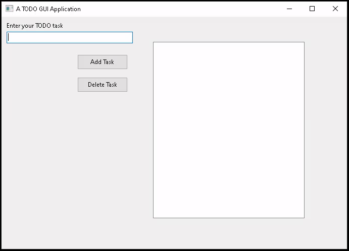

# DelphiVCL for Python <a href="https://github.com/Embarcadero/DelphiVCL4Python/"></a>
Delphi's VCL library as a Python module for building native Windows GUI Applications

### Installation: ###

    pip install delphivcl   

### Supports: ###

* Win32 & Win64 x86 architectures
* Python cp3.6, cp3.7, cp3.8, cp3.9 and cp3.10

### Conda support: ###

* Win x86 and x64 from Python cp3.6 to cp3.10

### Quickstart Guide: ###

Let us create a **TODO Task Application** to understand some components of GUI Applications.

Let's take a look at the code to achieve that:

``` python
from delphivcl import *

class TodoApp(Form):

    def __init__(self, Owner):
        self.Caption = "A TODO GUI Application"
        self.SetBounds(100, 100, 700, 500)

        self.task_lbl = Label(self)
        self.task_lbl.SetProps(Parent=self, Caption="Enter your TODO task")
        self.task_lbl.SetBounds(10, 10, 125, 25)

        self.task_text_box = Edit(self)
        self.task_text_box.SetProps(Parent=self)
        self.task_text_box.SetBounds(10, 30, 250, 20)

        self.add_task_btn = Button(self)
        self.add_task_btn.Parent = self
        self.add_task_btn.SetBounds(150, 75, 100, 30)
        self.add_task_btn.Caption = "Add Task"
        self.add_task_btn.OnClick = self.__add_task_on_click

        self.del_task_btn = Button(self)
        self.del_task_btn.SetProps(Parent = self, Caption = "Delete Task")
        self.del_task_btn.SetBounds(150, 120, 100, 30)
        self.del_task_btn.OnClick = self.__del_task_on_click

        self.list_of_tasks = ListBox(self)
        self.list_of_tasks.Parent = self
        self.list_of_tasks.SetBounds(300, 50, 300, 350)

        self.OnClose = self.__on_form_close

    def __on_form_close(self, Sender, Action):
        Action.Value = caFree

    def __add_task_on_click(self, Sender):
        self.list_of_tasks.Items.Add(self.task_text_box.Text)
        self.task_text_box.Text = ""

    def __del_task_on_click(self, Sender):
        self.list_of_tasks.Items.Delete(0)

def main():
    Application.Initialize()
    Application.Title = "TODO App"
    app = TodoApp(Application)
    app.Show()
    FreeConsole()
    Application.Run()
    app.Destroy()
    
main()
```

As you save and run the above code, you should get the following GUI as a result:



Let's get to the details of what our code does behind the scenes. First, take a look at the `main()` function:
```python
def main():
    Application.Initialize()
    Application.Title = "TODO App"
```
In the above, `Application` instance is part of the `delphivcl` library that takes control of the GUI applications that we create. First line initializes the application, and the second line sets a title to the application.

Let's look at other lines of code of the `main()` function;

```python
    app = TodoApp(Application)
    app.Show()
    FreeConsole()
    Application.Run()
    app.Destroy()
```

Above, We instantiated the `TodoApp` class with `Application` as the `Owner`. We can show the GUI application on the screen using the `app.show()` method. GUI applications run in interaction with the command window (console). To make the GUI perform better without lags, we use `FreeConsole()` to give primary control to the GUI interface. `Application.Run()` starts the GUI interaction loop between the GUI and the user of the GUI application. When we close the GUI application, `app.Destroy()` takes care of not crashing it.

As we instantiated the GUI using `app = TodoApp(Application)`, the following code runs;

``` python
class TodoApp(Form):

    def __init__(self, Owner):
        self.Caption = "A TODO GUI Application"
        self.SetBounds(100, 100, 700, 500)
```
We inherit the `Form` class from the `delphivcl` library to create our GUI. In Delphi VCL, all the GUIs are treated as forms. The name of the GUI pop-up window is set using the `Caption` property/attribute. The line `self.SetBounds(100, 100, 700, 500)` is used to set;
- GUI window's origin position comparable to screen's origin position = `(100, 100)`
- length of the GUI window = `700` pixels
- width of the GUI window = `500` pixels. 

The upper left corner of the screen is treated as the `(0, 0)` coordinate with the left side as positive width and down as positive height. We can visualize it as shown below;


Let's look at the following few lines of code;

``` python
        self.task_lbl = Label(self)
        self.task_lbl.SetProps(Parent=self, Caption="Enter your TODO task")
        self.task_lbl.SetBounds(10, 10, 125, 25)
        
        self.task_text_box = Edit(self)
        self.task_text_box.Parent = self
        self.task_text_box.SetBounds(10, 30, 250, 20)
```

Above the first 3 lines of code will create the text - **Enter your TODO task** that you see on the GUI app. It does so by instantiating the `Label` class of the `delphivcl` library. Every component (`Label` here) has a `SetProps()` method to set its properties. Every component will have a scope that is set using its `Parent` property/attribute, which is set to `self` here. The `Caption` property sets the string of the text label. Similar to GUI app/Form, every component needs to be placed inside the GUI/Form using the `SetBounds()` method. For components, the top left corner of their parent (GUI window here) is considered as the origin - `(0, 0)`.

The next 3 lines of code create the edit box using the `Edit` class. We can also set the properties/attributes directly without using the `SetProps()` method like we did here using the code `self.task_text_box.Parent = self`. With the Form/GUI window as the parent of the Edit box, we can visualize its position and size as shown in the below figure. The width of the Edit box is automatically set to the default value.


Let's look at next few lines of code;

``` python
        self.add_task_btn = Button(self)
        self.add_task_btn.Parent = self
        self.add_task_btn.SetBounds(150, 75,100,30)
        self.add_task_btn.Caption = "Add Task"
        self.add_task_btn.OnClick = self.__add_task_on_click

        self.del_task_btn = Button(self)
        self.del_task_btn.SetProps(Parent = self, Caption = "Delete Task")
        self.del_task_btn.SetBounds(150,120,100,30)
        self.del_task_btn.OnClick = self.__del_task_on_click
```

Above lines of code create 2 Buttons - `Add Task` and `Delete Task` using the `Button` instance of the `delphivcl` package. For the buttons, one extra thing you'll find is an event handling using `self.add_task_btn.OnClick = self.__add_task_on_click` and `self.del_task_btn.OnClick = self.__del_task_on_click` for `Add Task` and `Delete Task` buttons respectively. We shall look after this in just a while.

Let's look at the next few lines of code;

``` python
        self.list_of_tasks = ListBox(self)
        self.list_of_tasks.Parent = self
        self.list_of_tasks.SetBounds(300,50,300,350)

        self.OnClose = self.__on_form_close
```

In the above lines of code, we created a list box using the `ListBox` instance. At the last line of code; `self.OnClose = self.__on_form_close`, we're handling the event of closing the GUI window using the following `__on_form_close()` method, which is mentioned below;

``` python
    def __on_form_close(self, Sender, Action):
        Action.Value = caFree
```

When we trigger the `OnClose` event, the Form automatically sends two arguments - `Sender` and `Action` to the event-handling method. This `Sender` and `Action` can be different  names. The line `Action.Value = caFree` releases the created instance (`app` here) using the `caFree` constant.

Let's now look at the event handling methods to `Add Task` and `Delete Task` buttons;

```python
    def __add_task_on_click(self, Sender):
        self.list_of_tasks.Items.Add(self.task_text_box.Text)
        self.task_text_box.Text = ""

    def __del_task_on_click(self, Sender):
        self.list_of_tasks.Items.Delete(0)
```

For all the events other than `OnClick`, the Form automatically sends a single argument (`Sender` here - this can be any name). We can add a task to the list box by typing anything into the text box and pressing on `Add Task` button. Delphi VCL library based GUIs support tab controls too, where you can also navigate from one component to another using the tab. So, you can press the `Tab` key on the keyboard, and as `Add Task` button gets highlighted, you can press `Enter/Return` key to fire its event. We add text from the text box to the list box using `Add()` method under `Items` under `ListBox` instance. We delete the earlier added events on a first-come, first-serve basis by pressing the `Delete Task` button.


For other platforms, check out [DelphiFMX4Python](https://github.com/Embarcadero/DelphiFMX4Python).

Powered by the Best [Windows IDE](https://www.embarcadero.com/products/delphi) Embarcadero Delphi and the [Python4Delphi library](https://github.com/pyscripter/python4delphi).
